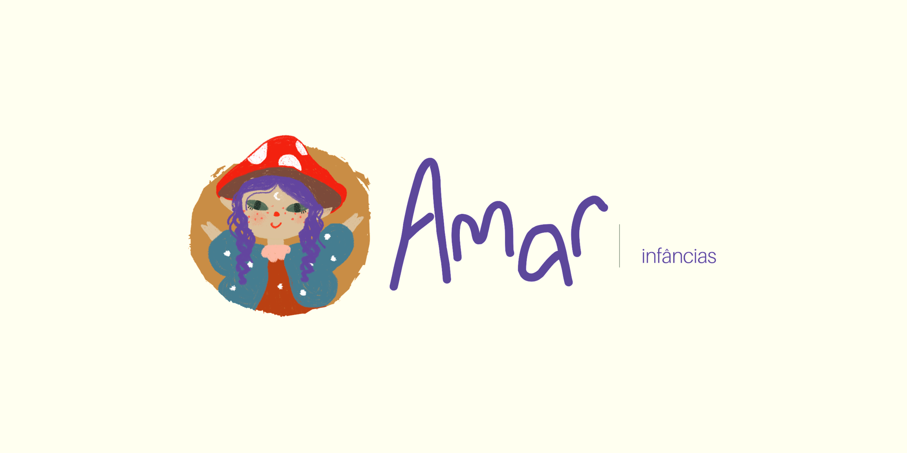

<p align="center"> 
</p>

<div align="center">

# Amar Infâncias Admin Dashboard

</div>

An interactive web dashboard for **Amar Infâncias**, a family photography business. This tool is designed to visualize and manage contract data, helping track growth, trends, and important metrics from internal systems.

## 📌 Related Projects

> The dashboard connects directly to a shared MySQL database used by a desktop GUI app built with Python.

🐍 <a href="https://github.com/andy-oliv/AMAR_contractGUI">AMAR_contractGUI (Python desktop app)</a>

## 📁 Folder structure

```Bash
Amar/ #main folder
├── amar-api/      # Backend (NestJS)
└── frontend/      # Frontend (React)
```

## 🚀 Technologies Used

<div>

### 💽 Backend


### 💻 Frontend


</div>

## 📦 Installation

### Prerequisites

- Node.js (v18+)
- MySQL running with access to the same database as the GUI app
- (Optional) Docker & Docker Compose

## 🛠️ Next steps

- Authentication

- View latest contracts

- filter by client name, date, location

- Deploy with Docker (frontend + API)

- Add user roles & authentication

- Export data (CSV, PDF)

- Email alerts for contract milestones

- Unit and Integration tests

- frontend development

## 💡 Motivation

This dashboard was built to automate and improve the internal management of Amar Infâncias. By connecting to the same database used by the Python contract generator, it's possible to visualize and analyze business data in real time.

## 📷 About Amar Infâncias

Amar Infâncias is a photography studio dedicated to capturing magical moments of childhood and family life. Learn more <a href="https://www.instagram.com/amarinfancias/">on Instagram</a>.

## 🧑‍💻 Author

Let's connect!

<a href="https://github.com/andy-oliv">GitHub</a> • <a href="https://www.linkedin.com/in/andy-oliveira/">LinkedIn</a> • <a href="https://www.instagram.com/_andrew.code/">Instagram</a>
